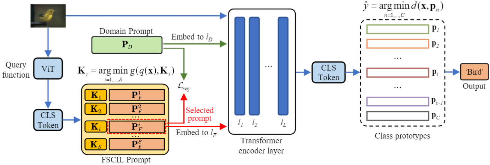

<h1 align="center">
PL-FSCIL: Harnessing the Power of Prompts for Few-Shot Class-Incremental Learning<br/>
</h1>

## Abstract
FFew-Shot Class-Incremental Learning (FSCIL) aims to enable deep neural networks to learn new tasks incrementally from a small number of labeled samples without forgetting previously learned tasks, closely mimicking human learning patterns. In this paper, we propose a novel approach called Prompt Learning for FSCIL (PL-FSCIL), which harnesses the power of prompts in conjunction with a pre-trained Vision Transformer (ViT) model to address the challenges of FSCIL effectively. Our work investigates the feasibility of directly applying visual prompt in FSCIL with a simplified model architecture. PL-FSCIL consists of two distinct prompts: the Domain Prompt and the FSCIL Prompt. Both prompts are tensors that enhance the model by embedding into the attention layer of the ViT architecture. Specifically, the Domain Prompt assists the ViT model in adapting to new data domains. The task-specific FSCIL Prompt, coupled with a prototype classifier, amplifies the model's ability to effectively handle incremental tasks. We validate the efficacy of PL-FSCIL on widely used benchmark datasets such as CIFAR-100 and CUB-200. The results showcase competitive performance, underscoring its promising potential for real-world applications where high-quality data is often scarce.

- The whole learning pipline of our model:
<p align="center">
  
</p>

## Environment
The system I used and tested in

- Ubuntu 20.04.5 LTS
- NVIDIA GeForce RTX 3090
- Pytorch 1.12.1

## Requirements

To install requirements:

```
pip install -r requirements.txt
```

## Datasets
For miniImagenet and CUB200, Please refer to [CEC](https://github.com/icoz69/CEC-CVPR2021)  to prepare the dataset.
For CIFAR100, the dataset will be download automatically.

## Training scripts
- CUB-200
```
python -m torch.distributed.launch  --nproc_per_node=1 --use_env --master_port 29503 main.py fscil_cub200 --model vit_base_patch16_224 --batch-size 25 --d_prompt_length 10 --length 10 --data-path ./data --output_dir ./output
```


- CIFAR-100
```
python -m torch.distributed.launch  --nproc_per_node=1 --use_env --master_port 29503 main.py fscil_cifar100 --model vit_base_patch16_224 --batch-size 25 --d_prompt_length 10 --length 10 --data-path ./data --output_dir ./output
```

## Results
- Evaluation on CUB-200:
<p align="center">
  
</p>

- Evaluation on CUB-CIFAR-100:
<p align="center">
  
</p>

- Compared with DualPrompt:
<p align="center">
  
</p>
